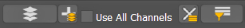
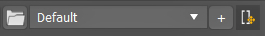

Documentation
===
# MaterialTextureLoader
Documentation for Material Texture Loader for 3ds Max

Table of contents
---
---
- [Description](#description)
  - [Support](#support)
  - [Links](#links)
- [UI](#ui)
  - [Top Menu](#uitopmenu)
  - [Texture Channels](#uichannels)
  - [Map Settings](#uimaps)

## Description
Material Texture Loader is a plugin for 3ds Max that creates advanced material setups from textures sets.
### Support 
- 3ds Max 2016-2024
- Vray(v3-6)
- Corona(v5-10)
- Redshift
- Arnold
- FStorm
- Octane
- Physical, PBR and Standard
### Links 
- [Youtube](https://youtu.be/HqMXw3Hht64?si=ejwyelh94iZaYcg1)
- [Gumroad](https://dmz.gumroad.com/l/ScriptBox)
- [Scriptspot](https://www.scriptspot.com/3ds-max/scripts/script-box)

  
## UI 
### Top Menu - Files 
</img>
 

  
<b>Load New Textures</b>: <em>Open image browser menu to load image files.</em>

  
  > You can multi-select any 3ds max supported image files.  
  > Selected files will be place in the Texture Channels dropdown list.  
  > Active Naming Filters will be used to automatically assign textures to Channels.
  > Previously loaded files will be removed.

  
<b>Add Extra Textrues</b>:  Open image browser menu, to add image files. 

  > where you add image files to the Texture Channels dropdown list.

  
<b>Use All Channels</b>: Activate all texture Channels

  > When materials don't use every texture channel, this will make all Texture Channel available.  
  > Maps that are created in this way are accessable after pressing _Add Material to Compact_ / _Add Material to Slate_.  
  > Maps will be placed adjacent to the material that is created.  

<dl>
  <b><em>Load New Textures</em></b>
  <dd>Opens a browser menu where you can multi-select image files to load into the Texture Channels dropdown list. Active Naming Filters will be used to automatically assign textures to Channels.</dd>
  <b><em>Add extra Textures</em></b>
  <dd>Opens a browser menu where you add image files to the Texture Channels dropdown list.</dd>
  <b><em>Use All Channels</em></b>
  <dd>When checked, this will make all Texture Channel available for use. For materials that don't use a specific channel, the created map will be accedible by pressing Add Material to Compact / Add Material to Slate.</dd>
  <b><em>Reset</em></b>
  <dd>Reset's the whole UI. Clears all image files from Channel, Material and select 'Default' Preset.</dd>
  <b><em>Naming Filters</em></b>
  <dd>Opens Texture Naming Filters menu, where you can activate existing Naming Filters. Up to 10 nameFilter files in 'nameFilters' directory will be listed. </dd>
</dl>

### Top Menu - Presets 
<table>
  <tr>
    <td width="60%">
       <dl>
        <b><em>MTL Installer</em></b>
        <dd>Opens the Installer menu for the Material Texture Loader. Contains Uninstall option and a list of all plugin directories.</dd>
        <b><em>Preset</em></b>
        <dd>Dropdown list will all saved Presets. Switching Presets will change the settings directy.</dd>
        <b><em>Save Preset</em></b>
        <dd>Opens a Preset Name menu, where you can save the Current Settings under the given name. If Preset name already is in use, will ask to overwrite existing Preset.</dd>
        <b><em>Dockable</em></b>
        <dd>Switch between dockable and window dialog mode.</dd>
      </dl>
    </td>
    <td width="40%" valign="top">
      </img>
    </td>
  </tr>
</table>

### Texture Channels 
<table>
  <tr>
    <td width="60%">
      <dl>
        <b><em>Enabled/Disable Channel</em></b>
        <dd>Disables a channel from creating maps, even when a texture is selected in the Texture Dropdown.</dd>
        <b><em>Channel Texture</em></b>
        <dd>Dropdown list where you can select a texture for the material channel.</dd>
        <b><em>Channel Strenght</em></b>
        <dd>Set the strength of the texures influence in the material channel.</dd>
        <b><em>Channel Settings</em></b>
        <dd>Button that displays the channel name. Click on the button to open channel specific settings.</dd>
        <b><em>Show Channel</em></b>
        <dd>When a material is created you can select which texture channel is displayed in the viewport.</dd>    
      </dl>
    </td>
    <td width="40%" valign="top">
      </img>
    </td>
  </tr>
</table>

</img>
</img> 
<dl>
  <dt>Enabled/Disable Channel</dt>
  <dd>Disables a channel from creating maps, even when a texture is selected in the Texture Dropdown.</dd>
  <dt>Channel Texture</dt>
  <dd>Dropdown list where you can select a texture for the material channel.</dd>
  <dt>Channel Strenght</dt>
  <dd>Set the strength of the texures influence in the material channel.</dd>
  <dt>Channel Settings</dt>
  <dd>Button that displays the channel name. Click on the button to open channel specific settings.</dd>
  <dt>Show Channel</dt>
  <dd>When a material is created you can select which texture channel is displayed in the viewport.</dd>    
</dl>
  
  
  

### Settings - Map
</img>
- **Map Type**: If the selected material class support it, choose between default 3ds Max Bitmaps or render specific texture maps. 
- **Blur**: Blur value being applied to each texture map.
- **Mapping Channel**: Sets the mapping channel for each texture map. 
- **Mapping Type**: Sets the mapping type for each texture map
  - Tiling: 
  - Real-world:
  - Tri-planar:
  - Spherical:
  
  
  

### Material Settings 
</img>

### Slot 
</img>
