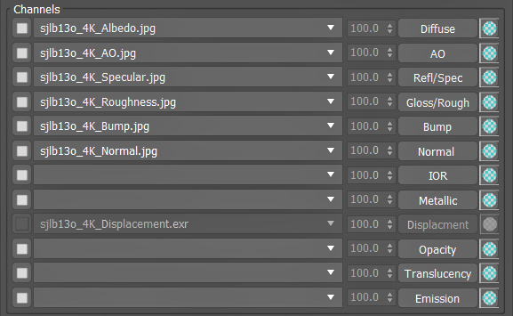

<h1 align ="center">Material Texture Loader</h1>

Advanced material creation plugin for 3ds max

<a href="https://youtu.be/WaiYY6T3cwg?si=zFbhcXlvGxeUF19K" target="_blank" rel="noopener noreferrer">Youtube</a> - <a href="https://dmz.gumroad.com/l/MaterialTextureLoader" target="_blank" rel="noopener noreferrer">Gumroad</a> - <a href="https://www.scriptspot.com/3ds-max/scripts/material-texture-loader" target="_blank" rel="noopener noreferrer">Scriptspot</a>

<h2> </h2>

</img>
<h3>Description</h3>
The Material Texure Loader can select texture files, automatic assigns them to material channels and create fully customizable materials setups.
It supports various mapping configurations, gamma adjusment, adds color correction maps, generates names for all materials and maps and links relevant mapping parameters. Quickly apply materials to objects or material editor. All settings can be saved as presets to support any type of workflow.
<h3>Main Features</h3>

- Customizable setups
- Auto texture recognition
- Per-channel color/gamma
- 5 mapping types
- MaxScript commands
- Presets
- 2-sided materials
- Drag-and-drop
- Apply to objects or editor
<h3>Support</h3>

- 3ds max 2016 - 2025.
- VRay (3-6)
- Corona (5-11)
- Redshift
- Arnold
- FStorm
- Octane
- Physical, PBR and Standard materials
<h3>Table of contents</h3>

- [Setup](#setup)
	- [Installation](#setup_instal)
	- [Create button](#setup_button)
	- [Custom Naming Filters](#setup_filters)
- [User Interface](#ui)
	- [Top Menu](#ui_topmenu)
	- [Channels](#ui_channels)
	- [Channel Settings](#ui_channelsettings)
	- [Maps](#ui_maps)
	- [Material](#ui_material)
	- [Slot](#ui_slot)
	- [Modifiers](#ui_modifiers)
- [Features list](#features)
	- [Instant material creation](#features_material)
	- [Advanced maps setups](#features_maps)
	- [Live updatable settings](#features_edit)
	- [Apply and save materials](#features_apply)

<h2> </h2>
 
<h1 align="center">Setup</h1>
<h3>Installation</h3>
There are two ways you can intall .mzp file in 3ds Max

- Drag and Drop the latest version of "MTL_v1.x install.mzp" from windows explorer into the 3ds max viewport
- Run "MTL_v1.x install.mzp" with 3ds max top menu. Go to Scripting > Run Script > select "MTL_v1.x install.mzp" > Open
On succesfull install, press Open MTL to start using the script.

<h2> </h2>
<h3>Create button</h3>

1. Restart 3ds Max.
2. In 3ds Max go to Customize > Customize User Interface > Toolbars > Category > DMZ.
3. Drag "Material Texture Loader" into a toolbar.

<h2> </h2>
<h3>Custom Naming Filters</h3>

1. Go to your 3ds max userscripts folder, DMZ folder (C\Users[Username]\AppData\Local\Autodesk\3dsMax\2018 - 64bit\ENU\userscripts\DMZ\MTL\namingFilters),
2. Any .ini file (eg. 'nameFilter_01 Default.ini') needs to be placed in that folder and must start with 'nameFilter_'.
3. Do not change the naming of the channels inside the file (eg. 'diffuse=', 'ambient=').
4. Add any word after the equal ('=') character, separated by a comma (','). These words are used to select textures for the right channel.
5. You can have up to 12 different .ini naming filter files, which all can be separately activated and combined in the MTL.

<h2> </h2>
 
<h1 align="center">User Interface</h1>
</img>
<h3>Top Menu</h3>

  
<b>Load New Textures</b>: Open texture file browser to select new files

  > You can multi-select any 3ds max supported image files.  
  > Selected files will be place in the Texture Channels dropdown list.  
  > Previously loaded files will be removed.  
  > Active Naming Filters will be used to automatically assign textures to Channels.  

  
<b>Add Extra Textrues</b>: Open texture file browser, to select additional files

  > You can multi-select any 3ds max supported image files.  
  > Selected files will be added to the Texture Channels dropdown list.  
  > Active Naming Filters will be used to automatically re-assign textures to Channels.  
  > Load New Textures: Open texture file browser to select new files.  

  
<b>Use All Channels</b>: Activate all texture Channels

  > When materials don't use every texture channel, this will make all Texture Channel available.  
  > Maps that are created in this way are accessable after pressing Add Material to Compact / Add Material to Slate.  
  > Maps will be placed adjacent to the material that is created.  

  
<b>Reset</b>: Reset entire UI back to Deafult

  > Selects Default as Preset  
  > Clears all image files from Texture Channels  
  > Clears Material Slot  

  
<b>Naming Filters</b>: Select active Naming Filters

  > Naming FIlters are used for automatic Texture Channel selection.  
  > You can activate any combination of listed Naming Filters.  
  > Up to 10 nameFilter files in nameFilters directory will be listed.  

  
<b>MTL Installer</b>: Opens Installer menu

  > Contains Uninstall option and a list of all plugin installation directories.  

  
<b>Preset</b>: Dropdown list of all saved settings

  > Switching Presets will change all settings directy.  
  > When Update is active, you can still switch Presets. Material type will be locked to current Material.  

  
<b>Save Preset</b>: Save current settings

  > Opens a Preset Name menu, where you can save the Current Settings under the given name.  
  > If Preset name already exists, menu will ask if you want to overwrite existing Preset.  

  
<b>Dockable</b>:Switch between dockable and window dialog mode

<h2> </h2>
</img>
<h3>Channels</h3>

  
<b>Enable/Disable Channel</b>: Disable or enabled a channel from creating maps

  > Disabeling channels will disable all other Channel controls.  
  > When disabled no maps are created, even when a texture file is selected in the dropdown list.  
  > Channel will be disabled automatically when a material type does not support the channel.  
  > You can force every channel to be active by checking Use All Channels (see: Top Menu - Files).  

  
<b>Channel Texture</b>: Select a texture file for the channel from the dropdownlist

  > For selected tecxture files a texture map will be created and connected to the material.  
  > Texture files will be available when loaded in with Load New Textures or Add Extra Textrues.  
  > Select empty item to deselect any texture file. No map will be created for this channel.  

  
<b>Channel Strength</b>: Set the strength or influence of the texture image

  > Control will be disabled when material type does not have support for Texture Strength.  

  
<b>Channel Settings</b>: Button that displays channel name and opens channel specific settings

  > (see: Channels - Settings.)  

  
<b>Show Channel</b>: Show channels texture map in viewport

  > Only 1 channel can be displayed in viewport.  
  > Only works when a material is created.  

<h2> </h2>
</img>
<h3>Channel Settings</h3>

  
<b>Color Space</b>: Choose between different type of color space input for texture file.

  
<b>Auto linear-sRGB</b>: when sRGB Color Space is selected and 32bit images are loaded, load files as linear-sRGB.

  
<b>Gamma</b>: Gamma input value for texture file.

  
<b>Color Correction</b>: Inlcude a color correction map for the texture channel.

  
<b>Inver Color</b>: Invert the colors of the texture channel.

  > Will add an extra map to invert colors, or use existing map settings if possible.  

  
<b>Set</b>: Accepts the current settings for the texture channel.

  > Click the 'X' icon if you wish to cancel setting changes.  

<h2> </h2>
</img>
<h3>Maps</h3>

  
<b>Map Type</b>: Choose between standard and render specific texture map

  > Render specific texture maps will be selected based of the material type selected.  
  > Not all renderers support standard Bitmaps.  

  
<b>Blur</b>: Blur value applied to each texture map

  > Blur is applied to all channels equally. There is no option for channel specifc blur values.  

Mapping Channel Set mapping channel for all texture maps

  
<b>Mapping Type</b>: Set the mapping type for each texture map

  
<b>Size</b>: set U and V mapping size

  
<b>Non-Uniform Size</b>: Enable

<h2> </h2>
</img>
<h3>Material</h3>

  
<b>Active Render Material</b>: Set Material Type to active renderer.

  > When active automatically switches Material Type when renderer is changed.  
  > Will de-activate when activating Update and existing material is not compatible will active Renderer.  

  
<b>Material Type</b>: Select from dropdown list with any supported materials.

  > De-activates Active Render Material when you select other material type that is compatible with the active renderer.  

  
<b>Diffuse</b>: Set the materials base diffuse color

  
<b>Reflection</b>: Set the materials base reflection color

  
<b>Glossiness</b>: Set the materials base glossiness value

  
<b>Refl. IOR</b>: Set the Materials base IOR value

  > Uncheck checkbox will set IOR value to the materials max IOR value.  

  
<b>2-Sided</b>: Makes the material 2-sided

  > Depending on the Material Type an extra 2-sided material is created.  
  > With Update active you can switch between 2-sided and not 2-sided. Materials in material editors will be correctly updated.  
  > When Updating a material to being not 2-sided. The old 2-sided material is still applied to existing objects.  

  
<b>ID</b>: Set the materials ID Channel

  
<b>Create Material</b>: Create a material with selected textures and settings.

  > If Auto-accept Name (A) is un-checked, a Material Name window will open.  

  
<b>Auto-accept Name(A)</b>: Create material name derived from selected textures.

  > If Auto-accept Name is un-checked, a Material Name window will open when creating a material.  
  > Derived name is the common part of all selected texture files.  

  
<b>Update</b>: Lock and adjust created material with any changes to textures and settings

  > With Update active you cannot change Material Type.  
  > Loading New or Adding Extra Textures automatically re-assigns textures. With Update active, a message box will pop-up to confirm.  

  
<b>Clear</b>: Clears only the current created material.

  > Unlike Reset, textures and settings are kept as is.  

<h2> </h2>
</img>
<h3>Slot</h3>

  
<b>Material Button</b>: Created material can be dragged into objects, editors or material slots.

  > Shows a renderer preview of the material if Render Material Preview is on.  

  
<b>Show Material in Viewport</b>: Shows created material in viewport

  > When active no texture channel can be displayed in viewport.  
  > Only works when a material is created.  

  
<b>Render Material Preview</b>: Renders a small preview thumbnail

  > Preview image is taken from the Material Editor.  

  
<b>Render Preview Background</b>: Renders a checkpattern in the preview background.

  > Not all renderers support this feature.  

  
<b>Save Render Preview</b>: Opens a save file dialog, to save current render preview.

  
<b>Add Material to Selection</b>: Applies to current material to selected objects.

  > If Modifiers are checked, these will also be added to the selecte objects.  

  
<b>Add Material to Material Library</b>: Opens a file loading dialog, to select a material library in whhich to save current material.

  
<b>Add Material to Compact Editor</b>: Adds current material to Indicated Sample Slot of the Compact Material Editor 

  
<b>Add Material to Slate Material Editor</b>: Adds current material to Indicated View of the Slate Material Editor 

<h2> </h2>
<h3>Modifiers</h3>

  
<b>uvMap</b>: If checked and when using Add Material to Selection, add uv_map modifer to selected objects.

  > uv_map will be using real-world tiling, if this option is selected in Maps settings.  

  
<b>Displace</b>: If checked and when using Add Material to Selection, add render specific displacement modifer to selected objects.

  
<b>Height Value</b>: Height value of the displacement modifier.

  
<b>Center Point</b>: Sets the center point of the displacments height value.

<h2> </h2>
 
<h1 align="center">Features list</h1>
<h3>Instant material creation</h3>

- Automatic texture recognition and parameter linking for all channels
- Real-world, tri-planar,  random and spherical mapping
- Specular and Metallic workflow support
- Settings for color, reflection, glossiness, IOR, ID and 2-Sided materials

<h2> </h2>
<h3>Advanced maps setups</h3>

- Per channel color space and gamma input values and adjustments (including ACEScg, sRGB, linear-sRGB, Raw)
- Color/ao, normal/bump and specular/metallic compositing maps
- Extensive MaxScript commands to automate the creation process
- UDIM map loading
- Settings for blur, map channel, mapping size, rotation and random rotation

<h2> </h2>
<h3>Live updatable settings</h3>

- Instant rebuilding of textures, maps and parameters
- Quick texture selection per channel
- Per channel strength adjustment
- Switch between presets
- Show material preview and texture channels in viewport

<h2> </h2>
<h3>Apply and save materials</h3>

- Include uvw and displacement modifiers on material assignment
- Add materials and maps to Slate or Compact material editors
- Save to material library
- Save material thumbnail
